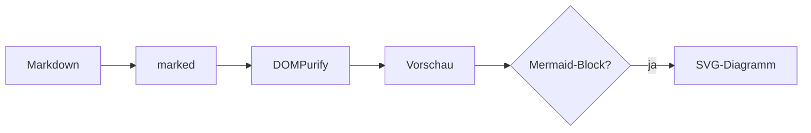

# Beispieldokument

Dieses Dokument testet das Rendering von **tiny-md** – Umlaute (ä, ö, ü, ß) inklusive.

## Textauszeichnung

*Kursiv*, **fett**, `Inline-Code`, ~~durchgestrichen~~ und ein [Link](https://example.com).

> Ein Blockzitat mit einer zweiten Zeile,
> die weiterläuft.

## Liste & Aufgaben

1. Erster Punkt
2. Zweiter Punkt
   - Unterpunkt
   - Noch einer

- [x] Erledigt
- [ ] Offen

## Tabelle

| Browser | Öffnen | Direkt speichern |
| ------- | ------ | ---------------- |
| Firefox | ✔      | ✖ (Download)     |
| Edge    | ✔      | ✔                |

## Diagramm (Mermaid)



## Code

```js
function greet(name) {
  return `Hallo, ${name}!`;
}
```

Gefährliches HTML wie <script>alert("xss")</script> wird entfernt.

---

Ende.
