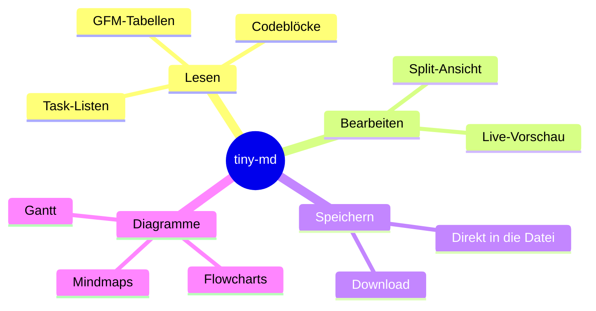
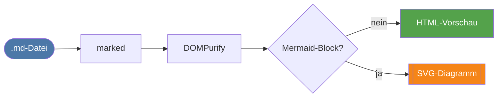
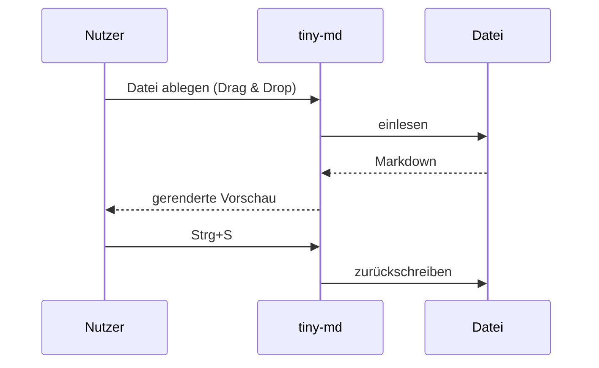
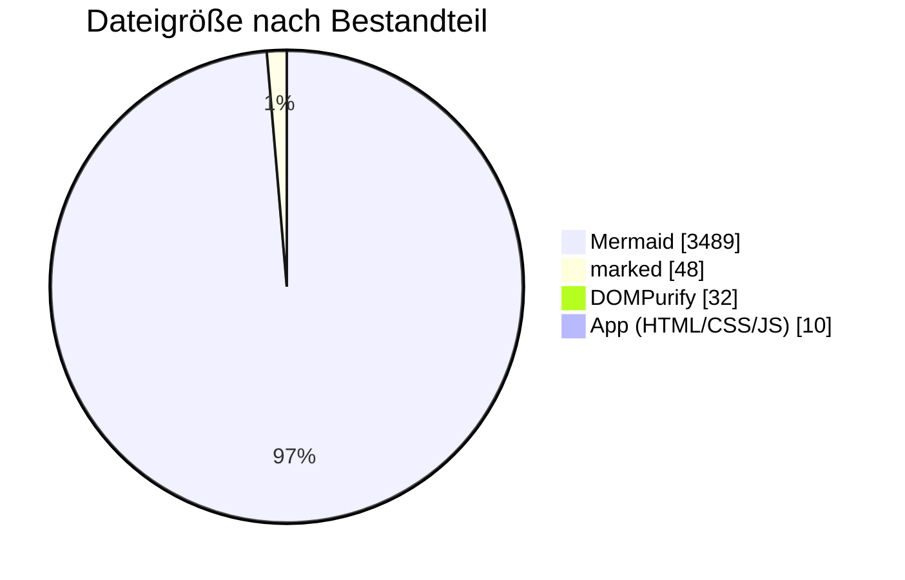
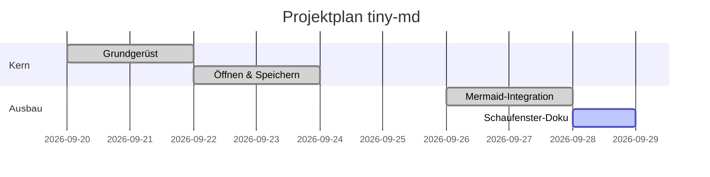
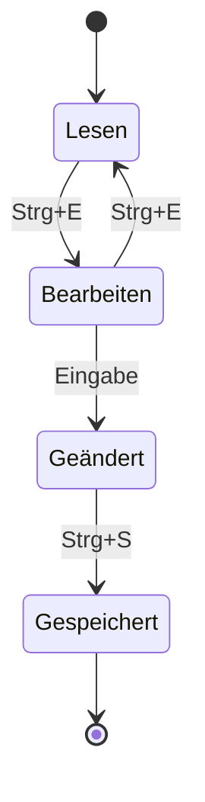
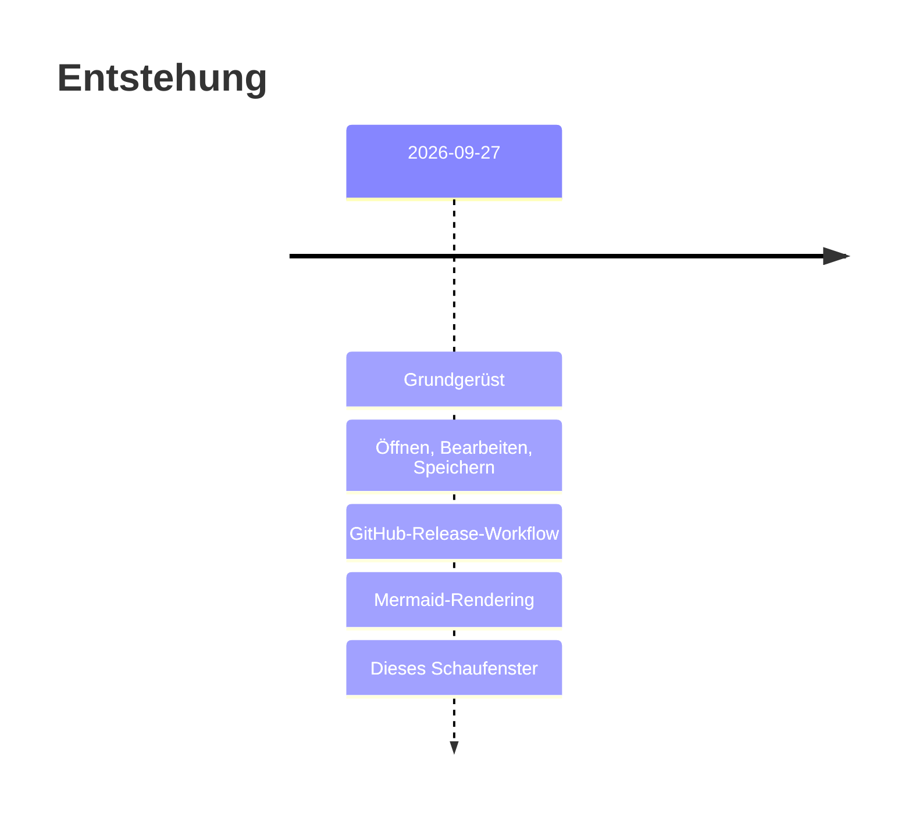
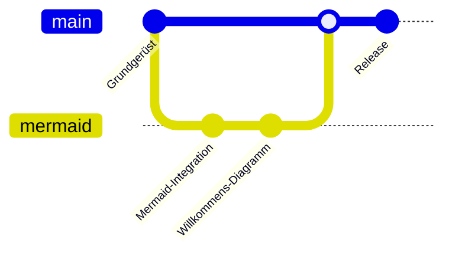

# Mermaid-Schaufenster

Dieses Dokument zeigt, was **tiny-md** mit eingebautem [Mermaid](https://mermaid.js.org/) rendern kann — komplett offline, alles in einer HTML-Datei. Über **Bearbeiten** (Strg+E) kann man die Diagramm-Quelltexte live verändern.

## Mindmap



## Flowchart mit Styling



## Sequenzdiagramm



## Kuchendiagramm



## Gantt



## Zustandsdiagramm



## Timeline



## Git-Graph



---

Alle Diagramme entstehen aus einfachen ` ```mermaid `-Codeblöcken im Markdown — die Quelltexte sind im Bearbeiten-Modus sichtbar.
